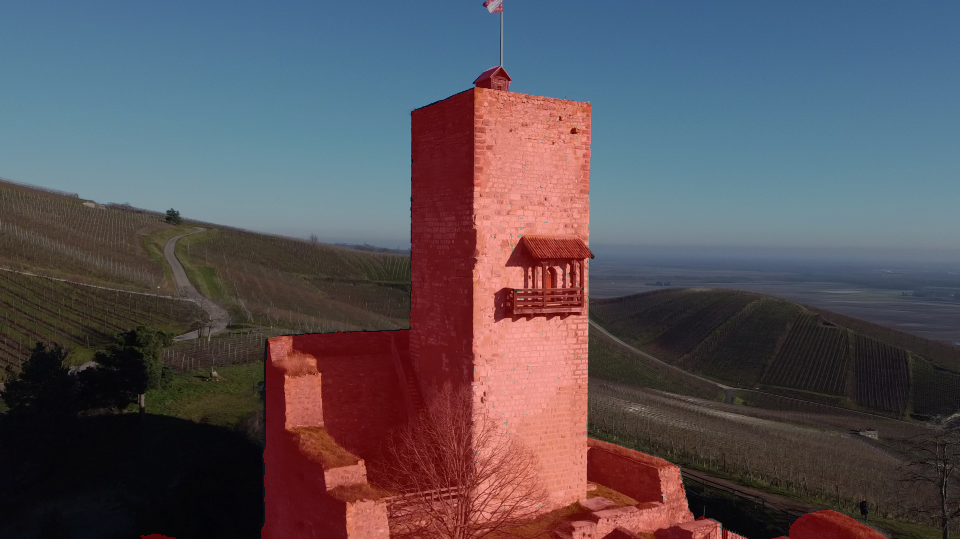
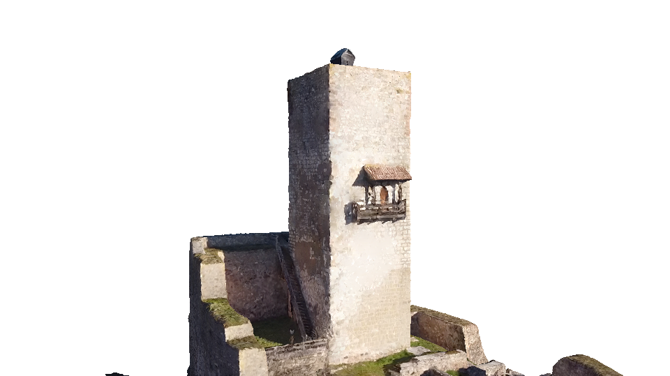

# Pose estimation via differentiable mesh rendering

[YouTube video](https://www.youtube.com/watch?v=cnBvj-kv49g)

```
python3 run.py
```

In this project, we deep into the  camera relocation problem, ie meaning finding the camera pose with respect to a scene. The proposed approach is based on a differentiable mesh rendering that enables a minimization of a photometric error between the image and a pre-built mesh of the scene.

## Mesh construction

The mesh is built with [COLMAP](https://colmap.github.io/) via classical photogrammetry. Then a textured mesh is obtained with [MVS](https://github.com/nmoehrle/mvs-texturing). You can then use [Meshlab](https://www.meshlab.net/) to clean your "object" and reduce its number of faces via Quadratic Edge.

A *.obj* mesh example is available under `data/mesh`.

## Pose estimation (relocation)

We assume that the camera intrinsics are known in advance and that the incoming images are already undistorted.

We start from an initial pose (not too far from the real pose !) and minimize the photometric loss between the mesh and the image. The considered pixels are masked with the mesh, so that the relocation process is not affected by the background. 

To take into account the camera exposure changing conditions, we adopt an affine transformation for the RGB pixels, so that `alpha` and `beta` are optimized (for the 3 channels).

Then a clipped L2 loss is used to reject outliers.

[PyTorch3D](https://pytorch3d.org/) is used for the differentiable mesh renderer. We dont assume anything about the light direction, we simply use an ambient light.

We use Adam for the optimizer, although further investigations could be done to find a best suited one. We add an early stopper.

We parameterize the rotations with the exponential mapping (Lie algebra to Lie group) to regress the 3 degrees of freedom.

The resulting pose is used as an initialization pose to the next image, although a Kalman Filter could be used to predict the next one.





## Potential issues

The mesh quality needs to be sufficiently good. I have tried to use Gaussian blur to improve robustness but unsuccessfully.

The optimization is quite sensitive to learning rate.

Big illumination changes can still be tricky to manage.
